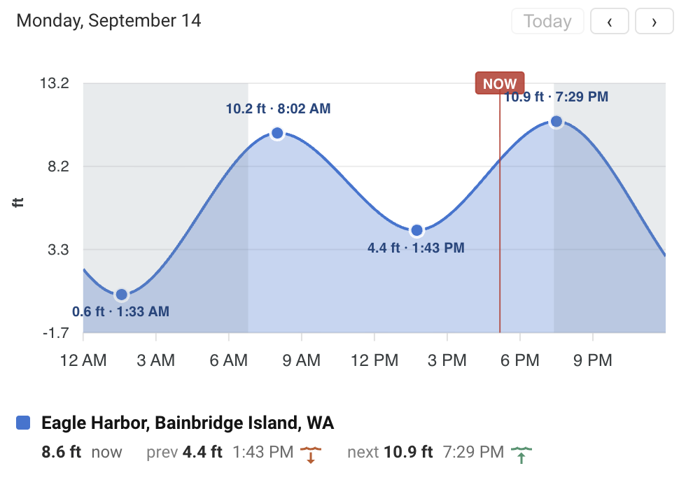
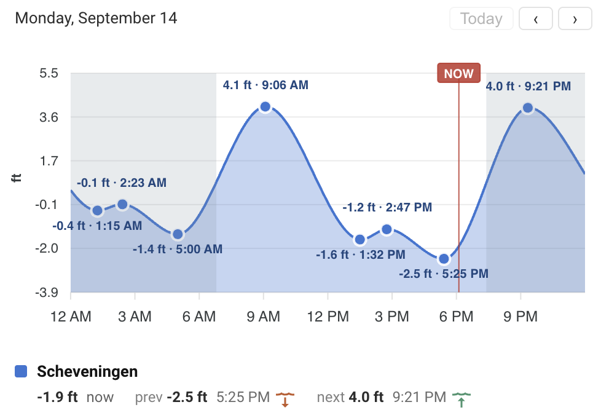
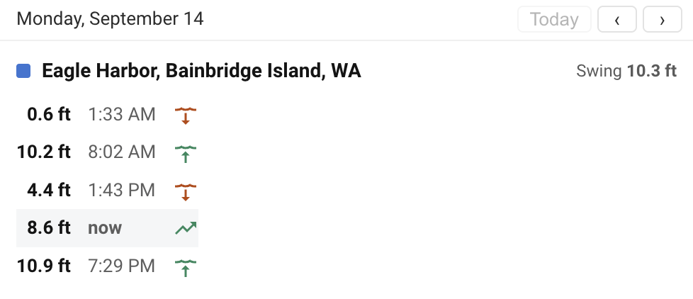
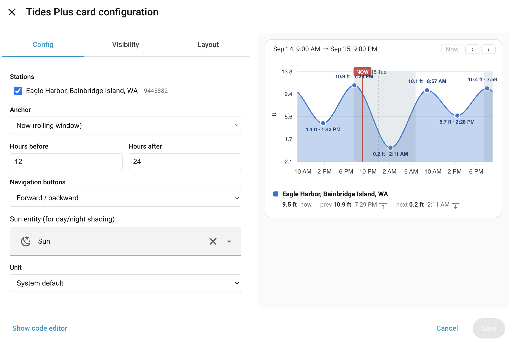
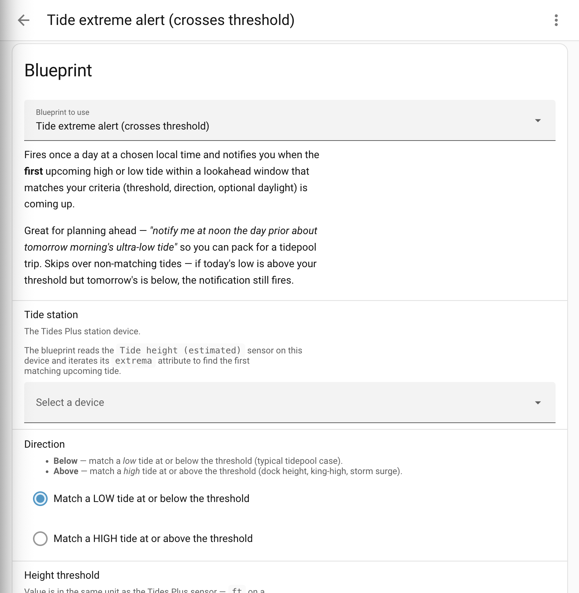

<p align="center">
  
</p>

<h1 align="center">Tides Plus</h1>

Home Assistant custom integration for tide predictions from multiple
public data sources.

- **Domain**: `ha_tides_plus`
- **Distribution**: HACS custom repository (see below)
- **Data sources**: [NOAA CO-OPS](https://api.tidesandcurrents.noaa.gov/api/prod/)
  (USA) and [Rijkswaterstaat](https://waterinfo.rws.nl/) (NL) — pick per
  station in the config flow. Add another with a single Python file:
  see the [how-to](docs/providers.md).

Provides one device per station with numeric height, direction, and
next/previous H/L sensors; bus events at every extremum; a
PCHIP-interpolated "current height" curve with an `extrema` attribute
for template automations; a Lovelace chart card and a summary card that
auto-load with the integration; and one starter automation blueprint.

See:

- [`DESIGN.md`](DESIGN.md) — architecture and the entity model.
- [`DEVELOPMENT.md`](DEVELOPMENT.md) — dev loop, Docker setup, debugging.
- [`docs/providers.md`](docs/providers.md) — how to add a new provider.
- [`IDEAS.md`](IDEAS.md) — what is open and what is shipped.
- [`blueprints/`](blueprints/) — bundled automation blueprints.
- [`brands/`](brands/) — brand-icon design source.

## Install

Not yet in the HACS default list — install as a **HACS custom
repository**.

### Prerequisite

[HACS](https://hacs.xyz/) itself must be installed and set up in your
Home Assistant. If it isn't yet, follow the
[HACS install guide](https://hacs.xyz/docs/use/download/download/)
first.

### 1. Add the repository to HACS

**One-click** (opens HACS on your HA instance at the right dialog):

[](https://my.home-assistant.io/redirect/hacs_repository/?owner=mullender&repository=ha-tides&category=integration)

**Manual fallback**:

1. HACS → three-dot menu (top right) → **Custom repositories**.
2. Repository: `https://github.com/mullender/ha-tides`
3. Type: **Integration**
4. Click **Add**.

### 2. Download the integration

- In the HACS *Integrations* list, find **Tides Plus** (it appears at
  the top once you close the custom-repositories dialog).
- Click **Download**, then **Download** again in the version dialog.
- **Restart Home Assistant** (Settings → System → Restart) so the new
  integration is loaded.

### 3. Add a station

**One-click**:

[](https://my.home-assistant.io/redirect/config_flow_start/?domain=ha_tides_plus)

**Manual fallback**: Settings → **Devices & Services** → **Add
Integration** → search *Tides Plus*.

Then:

1. Pick a data source — **NOAA** for US stations, **Rijkswaterstaat**
   for NL stations. The picker only shows when more than one provider
   is registered.
2. Enter a location or a station ID:
   - A place name — `Bridgeport, CT`, `Scheveningen`, `Half Moon Bay`.
   - A US ZIP code — `95019`.
   - A native station ID to skip the picker — `9445882` (NOAA
     7-digit), `scheveningen` (RWS slug).
   - Leave blank to use your HA-home coordinates.
3. Pick a station from the nearest-20 list. The entry (with 10
   sensors, bus events, and a device) is created immediately.

Repeat step 3 for each additional station — US and NL stations can
live side by side in the same install.

### Updating

HACS notifies you when a new release is tagged. Click **Update** in the
HACS integration list, then restart Home Assistant.

## Cards

Both cards ship inside the integration and auto-load on HA startup — no
extra HACS frontend install.

<p align="center">
  
  <br>
  <em>Eagle Harbor, WA — NOAA CO-OPS</em>
</p>

<p align="center">
  
  <br>
  <em>Scheveningen, NL — Rijkswaterstaat, with the North Sea "agger" wobble at each low tide</em>
</p>

```yaml
type: custom:tides-plus-card
stations:
  - 9445882          # required — one or more station IDs from any provider
anchor: day          # optional: day | now                     (default: day)
hours_before: 0      # optional                                (default: 0)
hours_after: 24      # optional                                (default: 24)
buttons: forward-backward   # optional: forward-backward | none (default: fwd/back)
sun_entity: sun.sun  # optional                                (default: sun.sun)
unit: imperial       # optional: metric | imperial             (default: follows HA)
```

<p align="center">
  
</p>

```yaml
type: custom:tides-plus-summary-card
stations: [9445882]
```

Both cards include a visual editor — click the pencil icon on any card
to configure it without writing YAML.

<p align="center">
  
</p>

### Layout options

Both cards support Home Assistant's `grid_options` for controlling size
in **Sections** dashboards. By default the chart card spans full width;
override with any combination of:

```yaml
type: custom:tides-plus-card
stations: [9445882]
grid_options:
  columns: full        # "full" or 1-4  (default: full)
  rows: 4              # grid rows      (default: 4 for chart, auto for summary)
```

| Option | Values | Chart default | Summary default |
|---|---|---|---|
| `columns` | `1`–`4` or `full` | `full` | `full` |
| `rows` | positive integer or `auto` | `4` | `auto` |

`grid_options` is a standard Home Assistant feature — see the HA
[dashboard cards documentation](https://www.home-assistant.io/dashboards/cards/#grid_options)
for the full set of keys (`min_columns`, `min_rows`, etc.).

## Blueprints

Bundled under `blueprints/automation/ha_tides_plus/`. Install via
**Settings → Automations & scenes → Blueprints → Import blueprint** and
paste:

```
https://raw.githubusercontent.com/mullender/ha-tides/main/blueprints/automation/ha_tides_plus/tide_extreme_alert.yaml
```

<p align="center">
  
</p>

See [`blueprints/README.md`](blueprints/README.md) for the full list and
per-blueprint notes.

## Quick start (development)

```
docker compose up -d
docker compose logs -f homeassistant
# open http://localhost:8123
```

`ha_config/` holds a seed `configuration.yaml` that enables `debugpy` on
port 5678 and turns on debug logging for the integration. First boot
takes ~30 s to install HA and generate the config; subsequent boots are
fast. Full dev walkthrough in [`DEVELOPMENT.md`](DEVELOPMENT.md).
