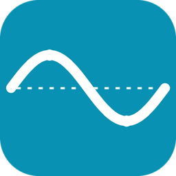

<p align="center">
  
</p>

<h1 align="center">Tides Plus (USA, NOAA)</h1>

Home Assistant custom integration for NOAA CO-OPS tide predictions.

- **Domain**: `ha_tides_plus`
- **Distribution**: HACS custom repository (see below)
- **Data source**: [NOAA Tides and Currents API](https://api.tidesandcurrents.noaa.gov/api/prod/)

Provides one device per station with numeric height, direction, and
next/previous H/L sensors; bus events at every extremum; a
PCHIP-interpolated "current height" curve with an `extrema` attribute
for template automations; a Lovelace chart card and a summary card that
auto-load with the integration; and one starter automation blueprint.

See:

- [`DESIGN.md`](DESIGN.md) — architecture and the entity model.
- [`DEVELOPMENT.md`](DEVELOPMENT.md) — dev loop, Docker setup, debugging.
- [`IDEAS.md`](IDEAS.md) — what is open and what is shipped.
- [`blueprints/`](blueprints/) — bundled automation blueprints.
- [`brands/`](brands/) — brand-icon design source.

## Install

Not yet in the HACS default list. Add as a **custom repository**:

1. HACS → three-dot menu → *Custom repositories*.
2. URL: `https://github.com/mullender/ha-tides`, category *Integration*.
3. Install, restart HA, then **Settings → Devices & Services → Add
   Integration** and search *Tides Plus (USA, NOAA)*.
4. Type a US ZIP, a place name, or a 7-digit station ID — or leave the
   query blank to use your HA-home coordinates. Pick a station from the
   list; the entry (with 10 sensors) is created.

## Cards

Both cards ship inside the integration and auto-load on HA startup — no
extra HACS frontend install.

```yaml
type: custom:tides-plus-card
stations:
  - 9445882          # required — one or more NOAA station IDs
anchor: day          # optional: day | now                     (default: day)
hours_before: 0      # optional                                (default: 0)
hours_after: 24      # optional                                (default: 24)
buttons: forward-backward   # optional: forward-backward | none (default: fwd/back)
sun_entity: sun.sun  # optional                                (default: sun.sun)
unit: imperial       # optional: metric | imperial             (default: follows HA)
```

```yaml
type: custom:tides-plus-summary-card
stations: [9445882]
```

## Blueprints

Bundled under `blueprints/automation/ha_tides_plus/`. Install via
**Settings → Automations & scenes → Blueprints → Import blueprint** and
paste:

```
https://raw.githubusercontent.com/mullender/ha-tides/main/blueprints/automation/ha_tides_plus/tide_extreme_alert.yaml
```

See [`blueprints/README.md`](blueprints/README.md) for the full list and
per-blueprint notes.

## Quick start (development)

```
docker compose up -d
docker compose logs -f homeassistant
# open http://localhost:8123
```

`ha_config/` holds a seed `configuration.yaml` that enables `debugpy` on
port 5678 and turns on debug logging for the integration. First boot
takes ~30 s to install HA and generate the config; subsequent boots are
fast. Full dev walkthrough in [`DEVELOPMENT.md`](DEVELOPMENT.md).
